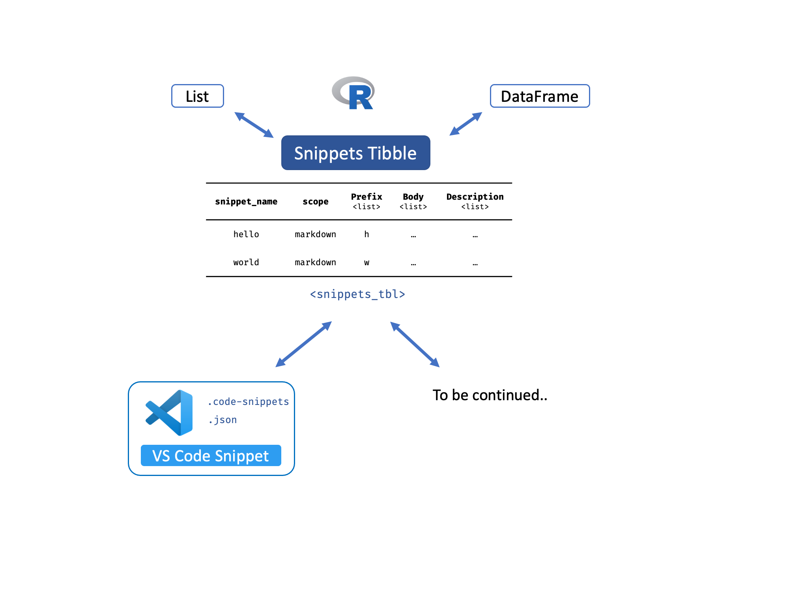

<!-- README.md is generated from README.Rmd. Please edit that file -->

```{r, include = FALSE}
knitr::opts_chunk$set(
  collapse = TRUE,
  comment = "#>",
  fig.path = "man/figures/README-",
  out.width = "100%"
)
```

# snipper

<!-- badges: start -->

[](https://lifecycle.r-lib.org/articles/stages.html#experimental) [](https://github.com/Lightbridge-KS/snipper/actions) [](https://app.codecov.io/gh/Lightbridge-KS/snipper?branch=main)

<!-- badges: end -->

> R package to Read, Write, and Manipulate Code Snippets (currently, [VS code snippet](https://code.visualstudio.com/docs/editor/userdefinedsnippets#_snippet-scope))

# Installation

You can install the development version of snipper from [GitHub](https://github.com/) with:

``` r
# install.packages("remotes")
remotes::install_github("Lightbridge-KS/snipper")
```

# Overview

`{snipper}` aims to be an interface for interacting with code snippets with an ease of manipulation in `R`.





## Snippet tibble

The central data structure for code snippet in `R` is **Snippet tibble** (`snippets_tbl`).

-   It is a subclass of [tibble](https://tibble.tidyverse.org), so that it can be manipulate with `{tidyverse}` tools.

-   It can be constructed in `R` by list or data frame.

-   It can be read or write to snippet file (currently, VS code).

-   Its structure and syntax are designed according to [VS Code snippet syntax](https://code.visualstudio.com/docs/editor/userdefinedsnippets#_snippet-syntax).

# Usage

```{r setup, message=FALSE, warning=FALSE}
library(snipper)
library(dplyr)
```

## Example Data

`{snipper}` comes with example snippet files. See example snippet files with `snipper_example()`:

```{r path_vs}
# List example VS Code Snippet files
snipper_example("vscode")

# Path to a folder containing example VS Code Snippet files
path_vs <- snipper_example("vscode", return_path = TRUE)
```

## Read Snippet from File

Read snippet into `R` as snippet [tibble](https://tibble.tidyverse.org) with `read_snip_*()` function.

For example, read [VS Code Snippets](https://code.visualstudio.com/docs/editor/userdefinedsnippets) from a folder with:

```{r my_snp}
my_snp <- read_snip_vscode(path_vs)
my_snp
```

```{r}
class(my_snp)
```

## Create Snippet from R

You can create snippet tibble directly from `R` with:

### List

```{r my_snp1}
ls <- list(
  hello = list(
    scope = "plaintext",
    prefix = "hello",
    body = c("hello, there", "$0"),
    description = "Say Hello"
  ),
  world = list(
    prefix = "world",
    body = c("Hi","Hi", "Welcome to a new world!")
  )
) 

# To Snippet Tibble
my_snp1 <- as_snippets_tbl(ls)
my_snp1
```

### Data Frame

```{r tbl_df}
tbl_df <- tibble::tibble(
  snippet_name = LETTERS[1:2],
  scope = rep("markdown", 2),
  prefix = tolower(snippet_name),
  body = paste0("You've get grade **", snippet_name, "**", " ${0}"),
  description = paste0("Insert grade ", snippet_name)
)

tbl_df
```

Convert to snippet tibble

```{r my_snp2}
my_snp2 <- as_snippets_tbl(tbl_df)
my_snp2
```

## Manipulate

Since snippet tibble is **a tibble**, you can use **tidy tools** from package like `{dplyr}` to filter, sort, and manipulate in various ways, for example:

Combine Snippets with:

```{r my_snp_all}
my_snp_all <- dplyr::bind_rows(my_snp, my_snp1, my_snp2) 
my_snp_all
```

Insert rows directly with `dplyr::rows_insert()`.

```{r vs_tbl_updated}
my_snp_all <- my_snp_all %>% 
  rows_insert(
    tibble::tibble(
      snippet_name = "goodnight",
      scope = "markdown,plaintext",
      prefix = list(c("goodnight", "gn")),
      body = list(c("Have a sweet dream ${1:darling}", "Goodnight!")),
      description = list("Say Goodnight")
    )
  ) 

my_snp_all
```

Filter language for "markdown" and "plaintext"

```{r my_snp_md}
my_snp_md <- my_snp_all %>% 
  filter(scope == "markdown,plaintext")

my_snp_md
```

## Show Snippet

Preview snippet with `show_snip_*()` function. For example, to preview VS code snippet as JSON use:

```{r}
show_snip_vscode(my_snp_md)
```

## Write Snippets

You can write snippet tibble into file with `write_snip_*()` functions.

To write snippet tibble as a **VS code snippet** to [multi-language, user-defined snippet](https://code.visualstudio.com/docs/editor/userdefinedsnippets#_snippet-scope) (`.code-snippets`) file, we use:

```{r}
.old_wd <- setwd(tempdir())

write_snip_vscode(my_snp_md, "my-snippet")

setwd(.old_wd)
```

------------------------------------------------------------------------

Last updated: `r Sys.Date()`
